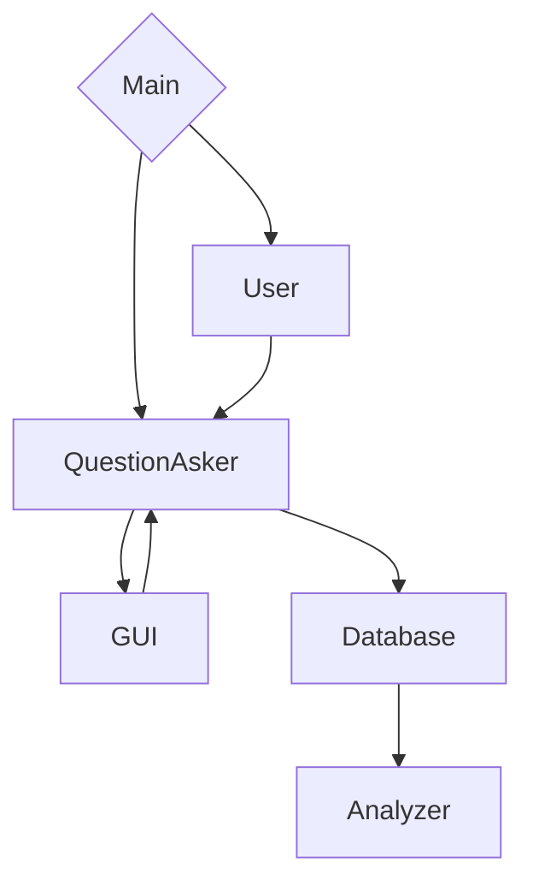
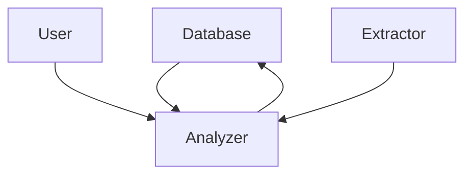
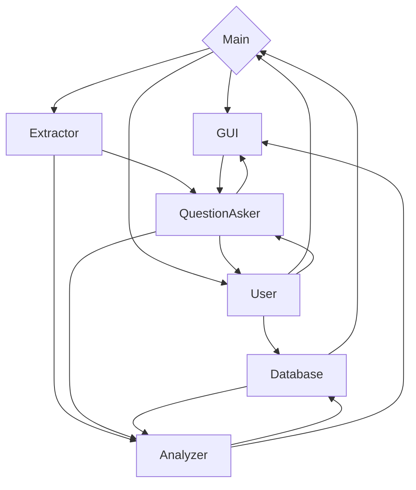

# Science Bowl
Current project status:  

## Overview
An advanced program for science bowl training that will analyze rounds to provide statistics as well as use machine learning to teach players in areas they may not be as familiar.

## Competition Description

> Launched in 1991, the National Science Bowl® (NSB) is a highly competitive science education and academic event among teams of high school and middle school students who compete in a fast-paced verbal forum to solve technical problems and answer questions in all branches of science and math. Each team is composed of four students, one alternate student, and a coach. Regional and national events encourage student involvement in math and science activities of importance to the Department of Energy and the Nation.

[- US DOE Website](https://science.osti.gov/wdts/nsb/About)

  

In this competition, teams compete to answer questions in "rounds" such as the one shown below.

  

## Problem Statement

The Science Bowl competition covers a large range of subject areas, and it is very difficult to know where to start studying. It is also quite difficult to go through practice questions and study them without another person there to read them to you. Long story short, studying for the competition is a lot of work, and there is currently no simple solution.

## Project Proposal

Many of the tasks that are required for studying content such as reading rounds, figuring out what things are necessary to study, etc. can easily be automated by a computer algorithm. This project will attempt to enhance the process of completing many of these tasks. The main functions of the project will be as follows:

### Steps
1. Extract data from PDF sample rounds
2. Analyze rounds and get statistics on most common topics
3. Display questions on a screen and give the users a time limit to answer them
4. Use some sort of text-to-voice algorithm to actually read the questions, so that it is more similar to an actual competition
5. Generate statistics on what topics individual users need to study
6. Implement machine learning to enhance steps 2 and 6, and to provide a better classification of topic areas
7. Sync with a database to layout what topics each member of a team is good at, and what they each need to study in order to be the most successful in the competition.

 ### Other Possible Features 
- GUI for training
- Display of questions as text
- Auto question reader
- Round selection
- Allow players to choose what rounds/categories they want to play
- Greater customizability
- Specific category selection
- Specific difficulty selection
- Round timers and controls
- Stop reading when buzzed
- Simulate real round
- Buzzer system integration

## Project Design
At this point in time, the project is going to incorporate the following objects:

Main: Responsible for initializing the game, and serving up the GUI to the user. It ties everything all together.
Extractor: This class is in charge of extracting questions from round files (as shown above). It will then move them into a format that includes all of the necessary information to ask a player a given question.
User: Keeps track of information and statistics about the player.
QuestionAsker: This is responsible for formatting the questions properly to be served up in the GUI, or maybe read out loud in the future.
Analyzer: The analyzer takes in the data provided by the user and the extractor, and generates statistics both for the player's strengths and weaknesses, and well as general statistics for all of the rounds.
Database: This object interacts with a database to help store and update data.
GUI: This is pretty self explanatory. Manages the GUI. It may integrate other objects as widgets, but that will come later.

### Interface
This project is going to, in a way, be separated into two different parts. The "Game" portion, and the "Analysis" portion. 

#### Game
The game portion is intended to ask players questions and record information about it. The game program flow may look as follows:

#### Analysis
The analysis portion analyzes the rounds and the game data. Here is what the flow of the analysis side may look like:

### Complex Program Flow
This is a demo of how the program might function as a whole.

### CRC Cards

### Object Interfaces

### GUI Layout

### GUI Object Layout

## Resources
### Tools to make project overview:
- [Mermaid Live editor](https://mermaid-js.github.io/mermaid-live-editor/#/edit/eyJjb2RlIjoiY2xhc3NEaWFncmFtXG5jbGFzcyBNYWluIHtcbiAgaW5pdCgpXG4gIFVzZXJcbiAgRXh0cmFjdG9yXG4gIEdVSVxufVxuY2xhc3MgVXNlciB7XG4gIGluaXQobmFtZSA6IHN0ciwgaWQgOiBpbnQsIGRia2V5IDogYmluKVxufVxuY2xhc3MgR1VJIHtcbiAgaW5pdChzdHlsZSA6IHN0cilcbn1cbmNsYXNzIEV4dHJhY3RvciB7XG4gIGluaXQoKVxufVxuY2xhc3MgUXVlc3Rpb25Bc2tlciB7XG4gIGluaXQoKVxufVxuY2xhc3MgQW5hbHl6ZXIge1xuICBoaVxufVxuY2xhc3MgRGF0YWJhc2Uge1xuICBpbml0KClcbn1cblxuTWFpbiAtLT4gR1VJXG5NYWluIC0tPiBFeHRyYWN0b3Jcbk1haW4gLS0-IFVzZXJcblVzZXIgLS0-IE1haW5cblVzZXIgLS0-IERhdGFiYXNlXG5Vc2VyIC0tPiBRdWVzdGlvbkFza2VyXG5RdWVzdGlvbkFza2VyIC0tPiBVc2VyXG5FeHRyYWN0b3IgLS0-IFF1ZXN0aW9uQXNrZXJcbkV4dHJhY3RvciAtLT4gQW5hbHl6ZXJcblF1ZXN0aW9uQXNrZXIgLS0-IEdVSVxuUXVlc3Rpb25Bc2tlciAtLT4gQW5hbHl6ZXJcbkFuYWx5emVyIC0tPiBEYXRhYmFzZVxuQW5hbHl6ZXIgLS0-IEdVSVxuRGF0YWJhc2UgLS0-IE1haW5cbkRhdGFiYXNlIC0tPiBBbmFseXplclxuR1VJIC0tPiBRdWVzdGlvbkFza2VyXG4gICAgICAgICAgICAiLCJtZXJtYWlkIjp7InRoZW1lIjoiZGVmYXVsdCIsInRoZW1lVmFyaWFibGVzIjp7ImJhY2tncm91bmQiOiJ3aGl0ZSIsInByaW1hcnlDb2xvciI6IiNFQ0VDRkYiLCJzZWNvbmRhcnlDb2xvciI6IiNmZmZmZGUiLCJ0ZXJ0aWFyeUNvbG9yIjoiaHNsKDgwLCAxMDAlLCA5Ni4yNzQ1MDk4MDM5JSkiLCJwcmltYXJ5Qm9yZGVyQ29sb3IiOiJoc2woMjQwLCA2MCUsIDg2LjI3NDUwOTgwMzklKSIsInNlY29uZGFyeUJvcmRlckNvbG9yIjoiaHNsKDYwLCA2MCUsIDgzLjUyOTQxMTc2NDclKSIsInRlcnRpYXJ5Qm9yZGVyQ29sb3IiOiJoc2woODAsIDYwJSwgODYuMjc0NTA5ODAzOSUpIiwicHJpbWFyeVRleHRDb2xvciI6IiMxMzEzMDAiLCJzZWNvbmRhcnlUZXh0Q29sb3IiOiIjMDAwMDIxIiwidGVydGlhcnlUZXh0Q29sb3IiOiJyZ2IoOS41MDAwMDAwMDAxLCA5LjUwMDAwMDAwMDEsIDkuNTAwMDAwMDAwMSkiLCJsaW5lQ29sb3IiOiIjMzMzMzMzIiwidGV4dENvbG9yIjoiIzMzMyIsIm1haW5Ca2ciOiIjRUNFQ0ZGIiwic2Vjb25kQmtnIjoiI2ZmZmZkZSIsImJvcmRlcjEiOiIjOTM3MERCIiwiYm9yZGVyMiI6IiNhYWFhMzMiLCJhcnJvd2hlYWRDb2xvciI6IiMzMzMzMzMiLCJmb250RmFtaWx5IjoiXCJ0cmVidWNoZXQgbXNcIiwgdmVyZGFuYSwgYXJpYWwiLCJmb250U2l6ZSI6IjE2cHgiLCJsYWJlbEJhY2tncm91bmQiOiIjZThlOGU4Iiwibm9kZUJrZyI6IiNFQ0VDRkYiLCJub2RlQm9yZGVyIjoiIzkzNzBEQiIsImNsdXN0ZXJCa2ciOiIjZmZmZmRlIiwiY2x1c3RlckJvcmRlciI6IiNhYWFhMzMiLCJkZWZhdWx0TGlua0NvbG9yIjoiIzMzMzMzMyIsInRpdGxlQ29sb3IiOiIjMzMzIiwiZWRnZUxhYmVsQmFja2dyb3VuZCI6IiNlOGU4ZTgiLCJhY3RvckJvcmRlciI6ImhzbCgyNTkuNjI2MTY4MjI0MywgNTkuNzc2NTM2MzEyOCUsIDg3LjkwMTk2MDc4NDMlKSIsImFjdG9yQmtnIjoiI0VDRUNGRiIsImFjdG9yVGV4dENvbG9yIjoiYmxhY2siLCJhY3RvckxpbmVDb2xvciI6ImdyZXkiLCJzaWduYWxDb2xvciI6IiMzMzMiLCJzaWduYWxUZXh0Q29sb3IiOiIjMzMzIiwibGFiZWxCb3hCa2dDb2xvciI6IiNFQ0VDRkYiLCJsYWJlbEJveEJvcmRlckNvbG9yIjoiaHNsKDI1OS42MjYxNjgyMjQzLCA1OS43NzY1MzYzMTI4JSwgODcuOTAxOTYwNzg0MyUpIiwibGFiZWxUZXh0Q29sb3IiOiJibGFjayIsImxvb3BUZXh0Q29sb3IiOiJibGFjayIsIm5vdGVCb3JkZXJDb2xvciI6IiNhYWFhMzMiLCJub3RlQmtnQ29sb3IiOiIjZmZmNWFkIiwibm90ZVRleHRDb2xvciI6ImJsYWNrIiwiYWN0aXZhdGlvbkJvcmRlckNvbG9yIjoiIzY2NiIsImFjdGl2YXRpb25Ca2dDb2xvciI6IiNmNGY0ZjQiLCJzZXF1ZW5jZU51bWJlckNvbG9yIjoid2hpdGUiLCJzZWN0aW9uQmtnQ29sb3IiOiJyZ2JhKDEwMiwgMTAyLCAyNTUsIDAuNDkpIiwiYWx0U2VjdGlvbkJrZ0NvbG9yIjoid2hpdGUiLCJzZWN0aW9uQmtnQ29sb3IyIjoiI2ZmZjQwMCIsInRhc2tCb3JkZXJDb2xvciI6IiM1MzRmYmMiLCJ0YXNrQmtnQ29sb3IiOiIjOGE5MGRkIiwidGFza1RleHRMaWdodENvbG9yIjoid2hpdGUiLCJ0YXNrVGV4dENvbG9yIjoid2hpdGUiLCJ0YXNrVGV4dERhcmtDb2xvciI6ImJsYWNrIiwidGFza1RleHRPdXRzaWRlQ29sb3IiOiJibGFjayIsInRhc2tUZXh0Q2xpY2thYmxlQ29sb3IiOiIjMDAzMTYzIiwiYWN0aXZlVGFza0JvcmRlckNvbG9yIjoiIzUzNGZiYyIsImFjdGl2ZVRhc2tCa2dDb2xvciI6IiNiZmM3ZmYiLCJncmlkQ29sb3IiOiJsaWdodGdyZXkiLCJkb25lVGFza0JrZ0NvbG9yIjoibGlnaHRncmV5IiwiZG9uZVRhc2tCb3JkZXJDb2xvciI6ImdyZXkiLCJjcml0Qm9yZGVyQ29sb3IiOiIjZmY4ODg4IiwiY3JpdEJrZ0NvbG9yIjoicmVkIiwidG9kYXlMaW5lQ29sb3IiOiJyZWQiLCJsYWJlbENvbG9yIjoiYmxhY2siLCJlcnJvckJrZ0NvbG9yIjoiIzU1MjIyMiIsImVycm9yVGV4dENvbG9yIjoiIzU1MjIyMiIsImNsYXNzVGV4dCI6IiMxMzEzMDAiLCJmaWxsVHlwZTAiOiIjRUNFQ0ZGIiwiZmlsbFR5cGUxIjoiI2ZmZmZkZSIsImZpbGxUeXBlMiI6ImhzbCgzMDQsIDEwMCUsIDk2LjI3NDUwOTgwMzklKSIsImZpbGxUeXBlMyI6ImhzbCgxMjQsIDEwMCUsIDkzLjUyOTQxMTc2NDclKSIsImZpbGxUeXBlNCI6ImhzbCgxNzYsIDEwMCUsIDk2LjI3NDUwOTgwMzklKSIsImZpbGxUeXBlNSI6ImhzbCgtNCwgMTAwJSwgOTMuNTI5NDExNzY0NyUpIiwiZmlsbFR5cGU2IjoiaHNsKDgsIDEwMCUsIDk2LjI3NDUwOTgwMzklKSIsImZpbGxUeXBlNyI6ImhzbCgxODgsIDEwMCUsIDkzLjUyOTQxMTc2NDclKSJ9fSwidXBkYXRlRWRpdG9yIjpmYWxzZX0)
### Pre-existing options

- [High School Science Bowl Practice](https://play.google.com/store/apps/details?id=com.jakepolatty.highschoolsciencebowlpractice&hl=en_US)

- [Tycho](https://apps.apple.com/us/app/tycho-play-science-quiz-bowl/id1191853690)

- [Protobowl](https://protobowl.com/scibowl/lobby)

  

### Links

- [MS Sample Questions](https://science.osti.gov/wdts/nsb/Regional-Competitions/Resources/MS-Sample-Questions)

- [HS Sample Questions](https://science.osti.gov/wdts/nsb/Regional-Competitions/Resources/HS-Sample-Questions)

<!--stackedit_data:
eyJwcm9wZXJ0aWVzIjoidGl0bGU6IFNjaWVuY2UgQm93bCBQcm
9qZWN0IFByb3Bvc2FsXG5hdXRob3I6IERhbGxpbiBHdWlzdGlc
biIsImhpc3RvcnkiOlsxMjk4NjE4MzksMTQ4NTc3NTEzNSwtMT
AwMjI1NzYxOSwtMTE5MDA3MTU3NywxMzA3MDY0NzM2LC00MDQw
MTAyNDMsLTc2MzI5MDE1MSwtNjUyNDExNTExLC0yMDQ3ODU2Mz
k3XX0=
-->